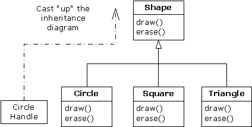
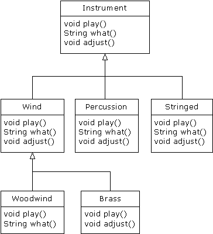
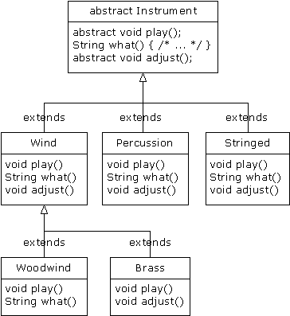
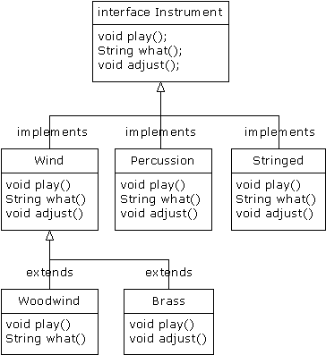
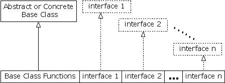
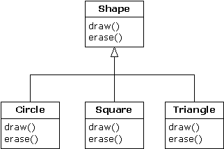
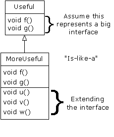

# 第7章 多态性


“对于面向对象的程序设计语言，多态性是第三种最基本的特征（前两种是数据抽象和继承。”

“多态性”（Polymorphism）从另一个角度将接口从具体的实施细节中分离出来，亦即实现了“是什么”与“怎样做”两个模块的分离。利用多形性的概念，代码的组织以及可读性均能获得改善。此外，还能创建“易于扩展”的程序。无论在项目的创建过程中，还是在需要加入新特性的时候，它们都可以方便地“成长”。

通过合并各种特征与行为，封装技术可创建出新的数据类型。通过对具体实施细节的隐藏，可将接口与实施细节分离，使所有细节成为“private”（私有）。这种组织方式使那些有程序化编程背景人感觉颇为舒适。但多态性却涉及对“类型”的分解。通过上一章的学习，大家已知道通过继承可将一个对象当作它自己的类型或者它自己的基础类型对待。这种能力是十分重要的，因为多个类型（从相同的基础类型中衍生出来）可被当作同一种类型对待。而且只需一段代码，即可对所有不同的类型进行同样的处理。利用具有多态性的方法调用，一种类型可将自己与另一种相似的类型区分开，只要它们都是从相同的基础类型中衍生出来的。这种区分是通过各种方法在行为上的差异实现的，可通过基础类实现对那些方法的调用。

在这一章中，大家要由浅入深地学习有关多态性的问题（也叫作动态绑定、推迟绑定或者运行期绑定）。同时举一些简单的例子，其中所有无关的部分都已剥除，只保留与多态性有关的代码。
## 7.1 上溯造型


在第6章，大家已知道可将一个对象作为它自己的类型使用，或者作为它的基础类型的一个对象使用。取得一个对象句柄，并将其作为基础类型句柄使用的行为就叫作“上溯造型”——因为继承树的画法是基础类位于最上方。

但这样做也会遇到一个问题，如下例所示（若执行这个程序遇到麻烦，请参考第3章的3.1.2小节“赋值”）：

```
//: Music.java 
// Inheritance & upcasting
package c07;

class Note {
  private int value;
  private Note(int val) { value = val; }
  public static final Note
    middleC = new Note(0), 
    cSharp = new Note(1),
    cFlat = new Note(2);
} // Etc.

class Instrument {
  public void play(Note n) {
    System.out.println("Instrument.play()");
  }
}

// Wind objects are instruments
// because they have the same interface:
class Wind extends Instrument {
  // Redefine interface method:
  public void play(Note n) {
    System.out.println("Wind.play()");
  }
}

public class Music {
  public static void tune(Instrument i) {
    // ...
    i.play(Note.middleC);
  }
  public static void main(String[] args) {
    Wind flute = new Wind();
    tune(flute); // Upcasting
  }
} ///:~
```

其中，方法Music.tune()接收一个Instrument句柄，同时也接收从Instrument衍生出来的所有东西。当一个Wind句柄传递给tune()的时候，就会出现这种情况。此时没有造型的必要。这样做是可以接受的；Instrument里的接口必须存在于Wind中，因为Wind是从Instrument里继承得到的。从Wind向Instrument的上溯造型可能“缩小”那个接口，但不可能把它变得比Instrument的完整接口还要小。

### 7.1.1 为什么要上溯造型

这个程序看起来也许显得有些奇怪。为什么所有人都应该有意忘记一个对象的类型呢？进行上溯造型时，就可能产生这方面的疑惑。而且如果让tune()简单地取得一个Wind句柄，将其作为自己的自变量使用，似乎会更加简单、直观得多。但要注意：假如那样做，就需为系统内Instrument的每种类型写一个全新的tune()。假设按照前面的推论，加入Stringed（弦乐）和Brass（铜管）这两种Instrument（乐器）：

```
//: Music2.java 
// Overloading instead of upcasting

class Note2 {
  private int value;
  private Note2(int val) { value = val; }
  public static final Note2
    middleC = new Note2(0), 
    cSharp = new Note2(1),
    cFlat = new Note2(2);
} // Etc.

class Instrument2 {
  public void play(Note2 n) {
    System.out.println("Instrument2.play()");
  }
}

class Wind2 extends Instrument2 {
  public void play(Note2 n) {
    System.out.println("Wind2.play()");
  }
}

class Stringed2 extends Instrument2 {
  public void play(Note2 n) {
    System.out.println("Stringed2.play()");
  }
}

class Brass2 extends Instrument2 {
  public void play(Note2 n) {
    System.out.println("Brass2.play()");
  }
}

public class Music2 {
  public static void tune(Wind2 i) {
    i.play(Note2.middleC);
  }
  public static void tune(Stringed2 i) {
    i.play(Note2.middleC);
  }
  public static void tune(Brass2 i) {
    i.play(Note2.middleC);
  }
  public static void main(String[] args) {
    Wind2 flute = new Wind2();
    Stringed2 violin = new Stringed2();
    Brass2 frenchHorn = new Brass2();
    tune(flute); // No upcasting
    tune(violin);
    tune(frenchHorn);
  }
} ///:~
```

这样做当然行得通，但却存在一个极大的弊端：必须为每种新增的Instrument2类编写与类紧密相关的方法。这意味着第一次就要求多得多的编程量。以后，假如想添加一个象tune()那样的新方法或者为Instrument添加一个新类型，仍然需要进行大量编码工作。此外，即使忘记对自己的某个方法进行过载设置，编译器也不会提示任何错误。这样一来，类型的整个操作过程就显得极难管理，有失控的危险。

但假如只写一个方法，将基础类作为自变量或参数使用，而不是使用那些特定的衍生类，岂不是会简单得多？也就是说，如果我们能不顾衍生类，只让自己的代码与基础类打交道，那么省下的工作量将是难以估计的。

这正是“多形性”大显身手的地方。然而，大多数程序员（特别是有程序化编程背景的）对于多形性的工作原理仍然显得有些生疏。
## 7.2 深入理解


对于Music.java的困难性，可通过运行程序加以体会。输出是Wind.play()。这当然是我们希望的输出，但它看起来似乎并不愿按我们的希望行事。请观察一下tune()方法：

```
public static void tune(Instrument i) {
// ...
i.play(Note.middleC);
}
```

它接收Instrument句柄。所以在这种情况下，编译器怎样才能知道Instrument句柄指向的是一个Wind，而不是一个Brass或Stringed呢？编译器无从得知。为了深入了理解这个问题，我们有必要探讨一下“绑定”这个主题。

### 7.2.1 方法调用的绑定

将一个方法调用同一个方法主体连接到一起就称为“绑定”（Binding）。若在程序运行以前执行绑定（由编译器和链接程序，如果有的话），就叫作“早期绑定”。大家以前或许从未听说过这个术语，因为它在任何程序化语言里都是不可能的。C编译器只有一种方法调用，那就是“早期绑定”。

上述程序最令人迷惑不解的地方全与早期绑定有关，因为在只有一个Instrument句柄的前提下，编译器不知道具体该调用哪个方法。

解决的方法就是“后期绑定”，它意味着绑定在运行期间进行，以对象的类型为基础。后期绑定也叫作“动态绑定”或“运行期绑定”。若一种语言实现了后期绑定，同时必须提供一些机制，可在运行期间判断对象的类型，并分别调用适当的方法。也就是说，编译器此时依然不知道对象的类型，但方法调用机制能自己去调查，找到正确的方法主体。不同的语言对后期绑定的实现方法是有所区别的。但我们至少可以这样认为：它们都要在对象中安插某些特殊类型的信息。

Java中绑定的所有方法都采用后期绑定技术，除非一个方法已被声明成final。这意味着我们通常不必决定是否应进行后期绑定——它是自动发生的。

为什么要把一个方法声明成final呢？正如上一章指出的那样，它能防止其他人覆盖那个方法。但也许更重要的一点是，它可有效地“关闭”动态绑定，或者告诉编译器不需要进行动态绑定。这样一来，编译器就可为final方法调用生成效率更高的代码。

### 7.2.2 产生正确的行为

知道Java里绑定的所有方法都通过后期绑定具有多形性以后，就可以相应地编写自己的代码，令其与基础类沟通。此时，所有的衍生类都保证能用相同的代码正常地工作。或者换用另一种方法，我们可以“将一条消息发给一个对象，让对象自行判断要做什么事情。”

在面向对象的程序设计中，有一个经典的“形状”例子。由于它很容易用可视化的形式表现出来，所以经常都用它说明问题。但很不幸的是，它可能误导初学者认为OOP只是为图形化编程设计的，这种认识当然是错误的。

形状例子有一个基础类，名为Shape；另外还有大量衍生类型：Circle（圆形），Square（方形），Triangle（三角形）等等。大家之所以喜欢这个例子，因为很容易理解“圆属于形状的一种类型”等概念。下面这幅继承图向我们展示了它们的关系：

 

上溯造型可用下面这个语句简单地表现出来：

```
Shape s = new Circle();
```

在这里，我们创建了Circle对象，并将结果句柄立即赋给一个Shape。这表面看起来似乎属于错误操作（将一种类型分配给另一个），但实际是完全可行的——因为按照继承关系，Circle属于Shape的一种。因此编译器认可上述语句，不会向我们提示一条出错消息。
当我们调用其中一个基础类方法时（已在衍生类里覆盖）：

```
s.draw();
```

同样地，大家也许认为会调用Shape的draw()，因为这毕竟是一个Shape句柄。那么编译器怎样才能知道该做其他任何事情呢？但此时实际调用的是Circle.draw()，因为后期绑定已经介入（多形性）。
下面这个例子从一个稍微不同的角度说明了问题：

```
//: Shapes.java
// Polymorphism in Java

class Shape { 
  void draw() {}
  void erase() {} 
}

class Circle extends Shape {
  void draw() { 
    System.out.println("Circle.draw()"); 
  }
  void erase() { 
    System.out.println("Circle.erase()"); 
  }
}

class Square extends Shape {
  void draw() { 
    System.out.println("Square.draw()"); 
  }
  void erase() { 
    System.out.println("Square.erase()"); 
  }
}

class Triangle extends Shape {
  void draw() { 
    System.out.println("Triangle.draw()"); 
  }
  void erase() { 
    System.out.println("Triangle.erase()");
  }
}

public class Shapes {
  public static Shape randShape() {
    switch((int)(Math.random() * 3)) {
      default: // To quiet the compiler
      case 0: return new Circle();
      case 1: return new Square();
      case 2: return new Triangle();
    }
  }
  public static void main(String[] args) {
    Shape[] s = new Shape[9];
    // Fill up the array with shapes:
    for(int i = 0; i < s.length; i++)
      s[i] = randShape();
    // Make polymorphic method calls:
    for(int i = 0; i < s.length; i++)
      s[i].draw();
  }
} ///:~
```

针对从Shape衍生出来的所有东西，Shape建立了一个通用接口——也就是说，所有（几何）形状都可以描绘和删除。衍生类覆盖了这些定义，为每种特殊类型的几何形状都提供了独一无二的行为。

在主类Shapes里，包含了一个static方法，名为randShape()。它的作用是在每次调用它时为某个随机选择的Shape对象生成一个句柄。请注意上溯造型是在每个return语句里发生的。这个语句取得指向一个Circle，Square或者Triangle的句柄，并将其作为返回类型Shape发给方法。所以无论什么时候调用这个方法，就绝对没机会了解它的具体类型到底是什么，因为肯定会获得一个单纯的Shape句柄。

main()包含了Shape句柄的一个数组，其中的数据通过对randShape()的调用填入。在这个时候，我们知道自己拥有Shape，但不知除此之外任何具体的情况（编译器同样不知）。然而，当我们在这个数组里步进，并为每个元素调用draw()的时候，与各类型有关的正确行为会魔术般地发生，就象下面这个输出示例展示的那样：

```
Circle.draw()
Triangle.draw()
Circle.draw()
Circle.draw()
Circle.draw()
Square.draw()
Triangle.draw()
Square.draw()
Square.draw()
```

当然，由于几何形状是每次随机选择的，所以每次运行都可能有不同的结果。之所以要突出形状的随机选择，是为了让大家深刻体会这一点：为了在编译的时候发出正确的调用，编译器毋需获得任何特殊的情报。对draw()的所有调用都是通过动态绑定进行的。

### 7.2.3 扩展性

现在，让我们仍然返回乐器（Instrument）示例。由于存在多形性，所以可根据自己的需要向系统里加入任意多的新类型，同时毋需更改tune()方法。在一个设计良好的OOP程序中，我们的大多数或者所有方法都会遵从tune()的模型，而且只与基础类接口通信。我们说这样的程序具有“扩展性”，因为可以从通用的基础类继承新的数据类型，从而新添一些功能。如果是为了适应新类的要求，那么对基础类接口进行操纵的方法根本不需要改变，
对于乐器例子，假设我们在基础类里加入更多的方法，以及一系列新类，那么会出现什么情况呢？下面是示意图：



所有这些新类都能与老类——tune()默契地工作，毋需对tune()作任何调整。即使tune()位于一个独立的文件里，而将新方法添加到Instrument的接口，tune()也能正确地工作，不需要重新编译。下面这个程序是对上述示意图的具体实现：

```
//: Music3.java
// An extensible program
import java.util.*;

class Instrument3 {
  public void play() {
    System.out.println("Instrument3.play()");
  }
  public String what() {
    return "Instrument3";
  }
  public void adjust() {}
}

class Wind3 extends Instrument3 {
  public void play() {
    System.out.println("Wind3.play()");
  }
  public String what() { return "Wind3"; }
  public void adjust() {}
}

class Percussion3 extends Instrument3 {
  public void play() {
    System.out.println("Percussion3.play()");
  }
  public String what() { return "Percussion3"; }
  public void adjust() {}
}

class Stringed3 extends Instrument3 {
  public void play() {
    System.out.println("Stringed3.play()");
  }
  public String what() { return "Stringed3"; }
  public void adjust() {}
}

class Brass3 extends Wind3 {
  public void play() {
    System.out.println("Brass3.play()");
  }
  public void adjust() {
    System.out.println("Brass3.adjust()");
  }
}

class Woodwind3 extends Wind3 {
  public void play() {
    System.out.println("Woodwind3.play()");
  }
  public String what() { return "Woodwind3"; }
}

public class Music3 {
  // Doesn't care about type, so new types
  // added to the system still work right:
  static void tune(Instrument3 i) {
    // ...
    i.play();
  }
  static void tuneAll(Instrument3[] e) {
    for(int i = 0; i < e.length; i++)
      tune(e[i]);
  }
  public static void main(String[] args) {
    Instrument3[] orchestra = new Instrument3[5];
    int i = 0;
    // Upcasting during addition to the array:
    orchestra[i++] = new Wind3();
    orchestra[i++] = new Percussion3();
    orchestra[i++] = new Stringed3();
    orchestra[i++] = new Brass3();
    orchestra[i++] = new Woodwind3();
    tuneAll(orchestra);
  }
} ///:~
```

新方法是what()和adjust()。前者返回一个String句柄，同时返回对那个类的说明；后者使我们能对每种乐器进行调整。

在main()中，当我们将某样东西置入Instrument3数组时，就会自动上溯造型到Instrument3。

可以看到，在围绕tune()方法的其他所有代码都发生变化的同时，tune()方法却丝毫不受它们的影响，依然故我地正常工作。这正是利用多形性希望达到的目标。我们对代码进行修改后，不会对程序中不应受到影响的部分造成影响。此外，我们认为多形性是一种至关重要的技术，它允许程序员“将发生改变的东西同没有发生改变的东西区分开”。
## 7.3 覆盖与过载


现在让我们用不同的眼光来看看本章的头一个例子。在下面这个程序中，方法play()的接口会在被覆盖的过程中发生变化。这意味着我们实际并没有“覆盖”方法，而是使其“过载”。编译器允许我们对方法进行过载处理，使其不报告出错。但这种行为可能并不是我们所希望的。下面是这个例子：

```
//: WindError.java 
// Accidentally changing the interface

class NoteX {
  public static final int
    MIDDLE_C = 0, C_SHARP = 1, C_FLAT = 2;
}

class InstrumentX {
  public void play(int NoteX) {
    System.out.println("InstrumentX.play()");
  }
}

class WindX extends InstrumentX {
  // OOPS! Changes the method interface:
  public void play(NoteX n) {
    System.out.println("WindX.play(NoteX n)");
  }
}

public class WindError {
  public static void tune(InstrumentX i) {
    // ...
    i.play(NoteX.MIDDLE_C);
  }
  public static void main(String[] args) {
    WindX flute = new WindX();
    tune(flute); // Not the desired behavior!
  }
} ///:~
```

这里还向大家引入了另一个易于混淆的概念。在InstrumentX中，play()方法采用了一个int（整数）数值，它的标识符是NoteX。也就是说，即使NoteX是一个类名，也可以把它作为一个标识符使用，编译器不会报告出错。但在WindX中，play()采用一个NoteX句柄，它有一个标识符n。即便我们使用“play(NoteX NoteX)”，编译器也不会报告错误。这样一来，看起来就象是程序员有意覆盖play()的功能，但对方法的类型定义却稍微有些不确切。然而，编译器此时假定的是程序员有意进行“过载”，而非“覆盖”。请仔细体会这两个术语的区别。“过载”是指同一样东西在不同的地方具有多种含义；而“覆盖”是指它随时随地都只有一种含义，只是原先的含义完全被后来的含义取代了。请注意如果遵守标准的Java命名规范，自变量标识符就应该是noteX，这样可把它与类名区分开。

在tune中，“InstrumentX i”会发出play()消息，同时将某个NoteX成员作为自变量使用（MIDDLE_C）。由于NoteX包含了int定义，过载的play()方法的int版本会得到调用。同时由于它尚未被“覆盖”，所以会使用基础类版本。

输出是：

```
InstrumentX.play()
```
## 7.4 抽象类和方法


在我们所有乐器（Instrument）例子中，基础类Instrument内的方法都肯定是“伪”方法。若去调用这些方法，就会出现错误。那是由于Instrument的意图是为从它衍生出去的所有类都创建一个通用接口。

之所以要建立这个通用接口，唯一的原因就是它能为不同的子类型作出不同的表示。它为我们建立了一种基本形式，使我们能定义在所有衍生类里“通用”的一些东西。为阐述这个观念，另一个方法是把Instrument称为“抽象基础类”（简称“抽象类”）。若想通过该通用接口处理一系列类，就需要创建一个抽象类。对所有与基础类声明的签名相符的衍生类方法，都可以通过动态绑定机制进行调用（然而，正如上一节指出的那样，如果方法名与基础类相同，但自变量或参数不同，就会出现过载现象，那或许并非我们所愿意的）。

如果有一个象Instrument那样的抽象类，那个类的对象几乎肯定没有什么意义。换言之，Instrument的作用仅仅是表达接口，而不是表达一些具体的实施细节。所以创建一个Instrument对象是没有意义的，而且我们通常都应禁止用户那样做。为达到这个目的，可令Instrument内的所有方法都显示出错消息。但这样做会延迟信息到运行期，并要求在用户那一面进行彻底、可靠的测试。无论如何，最好的方法都是在编译期间捕捉到问题。

针对这个问题，Java专门提供了一种机制，名为“抽象方法”。它属于一种不完整的方法，只含有一个声明，没有方法主体。下面是抽象方法声明时采用的语法：

```
abstract void X();
```

包含了抽象方法的一个类叫作“抽象类”。如果一个类里包含了一个或多个抽象方法，类就必须指定成abstract（抽象）。否则，编译器会向我们报告一条出错消息。

若一个抽象类是不完整的，那么一旦有人试图生成那个类的一个对象，编译器又会采取什么行动呢？由于不能安全地为一个抽象类创建属于它的对象，所以会从编译器那里获得一条出错提示。通过这种方法，编译器可保证抽象类的“纯洁性”，我们不必担心会误用它。

如果从一个抽象类继承，而且想生成新类型的一个对象，就必须为基础类中的所有抽象方法提供方法定义。如果不这样做（完全可以选择不做），则衍生类也会是抽象的，而且编译器会强迫我们用abstract关键字标志那个类的“抽象”本质。

即使不包括任何abstract方法，亦可将一个类声明成“抽象类”。如果一个类没必要拥有任何抽象方法，而且我们想禁止那个类的所有实例，这种能力就会显得非常有用。

Instrument类可很轻松地转换成一个抽象类。只有其中一部分方法会变成抽象方法，因为使一个类抽象以后，并不会强迫我们将它的所有方法都同时变成抽象。下面是它看起来的样子：



下面是我们修改过的“管弦”乐器例子，其中采用了抽象类以及方法：

```
//: Music4.java
// Abstract classes and methods
import java.util.*;

abstract class Instrument4 {
  int i; // storage allocated for each
  public abstract void play();
  public String what() {
    return "Instrument4";
  }
  public abstract void adjust();
}

class Wind4 extends Instrument4 {
  public void play() {
    System.out.println("Wind4.play()");
  }
  public String what() { return "Wind4"; }
  public void adjust() {}
}

class Percussion4 extends Instrument4 {
  public void play() {
    System.out.println("Percussion4.play()");
  }
  public String what() { return "Percussion4"; }
  public void adjust() {}
}

class Stringed4 extends Instrument4 {
  public void play() {
    System.out.println("Stringed4.play()");
  }
  public String what() { return "Stringed4"; }
  public void adjust() {}
}

class Brass4 extends Wind4 {
  public void play() {
    System.out.println("Brass4.play()");
  }
  public void adjust() { 
    System.out.println("Brass4.adjust()");
  }
}

class Woodwind4 extends Wind4 {
  public void play() {
    System.out.println("Woodwind4.play()");
  }
  public String what() { return "Woodwind4"; }
}

public class Music4 {
  // Doesn't care about type, so new types
  // added to the system still work right:
  static void tune(Instrument4 i) {
    // ...
    i.play();
  }
  static void tuneAll(Instrument4[] e) {
    for(int i = 0; i < e.length; i++)
      tune(e[i]);
  }
  public static void main(String[] args) {
    Instrument4[] orchestra = new Instrument4[5];
    int i = 0;
    // Upcasting during addition to the array:
    orchestra[i++] = new Wind4();
    orchestra[i++] = new Percussion4();
    orchestra[i++] = new Stringed4();
    orchestra[i++] = new Brass4();
    orchestra[i++] = new Woodwind4();
    tuneAll(orchestra);
  }
} ///:~
```

可以看出，除基础类以外，实际并没有进行什么改变。

创建抽象类和方法有时对我们非常有用，因为它们使一个类的抽象变成明显的事实，可明确告诉用户和编译器自己打算如何用它。
## 7.5 接口


“interface”（接口）关键字使抽象的概念更深入了一层。我们可将其想象为一个“纯”抽象类。它允许创建者规定一个类的基本形式：方法名、自变量列表以及返回类型，但不规定方法主体。接口也包含了基本数据类型的数据成员，但它们都默认为static和final。接口只提供一种形式，并不提供实施的细节。

接口这样描述自己：“对于实现我的所有类，看起来都应该象我现在这个样子”。因此，采用了一个特定接口的所有代码都知道对于那个接口可能会调用什么方法。这便是接口的全部含义。所以我们常把接口用于建立类和类之间的一个“协议”。有些面向对象的程序设计语言采用了一个名为“protocol”（协议）的关键字，它做的便是与接口相同的事情。

为创建一个接口，请使用interface关键字，而不要用class。与类相似，我们可在interface关键字的前面增加一个public关键字（但只有接口定义于同名的一个文件内）；或者将其省略，营造一种“友好的”状态。

为了生成与一个特定的接口（或一组接口）相符的类，要使用implements（实现）关键字。我们要表达的意思是“接口看起来就象那个样子，这儿是它具体的工作细节”。除这些之外，我们其他的工作都与继承极为相似。下面是乐器例子的示意图：



具体实现了一个接口以后，就获得了一个普通的类，可用标准方式对其进行扩展。

可决定将一个接口中的方法声明明确定义为“public”。但即便不明确定义，它们也会默认为public。所以在实现一个接口的时候，来自接口的方法必须定义成public。否则的话，它们会默认为“友好的”，而且会限制我们在继承过程中对一个方法的访问——Java编译器不允许我们那样做。

在Instrument例子的修改版本中，大家可明确地看出这一点。注意接口中的每个方法都严格地是一个声明，它是编译器唯一允许的。除此以外，Instrument5中没有一个方法被声明为public，但它们都会自动获得public属性。如下所示：

```
//: Music5.java
// Interfaces
import java.util.*;

interface Instrument5 {
  // Compile-time constant:
  int i = 5; // static & final
  // Cannot have method definitions:
  void play(); // Automatically public
  String what();
  void adjust();
}

class Wind5 implements Instrument5 {
  public void play() {
    System.out.println("Wind5.play()");
  }
  public String what() { return "Wind5"; }
  public void adjust() {}
}

class Percussion5 implements Instrument5 {
  public void play() {
    System.out.println("Percussion5.play()");
  }
  public String what() { return "Percussion5"; }
  public void adjust() {}
}

class Stringed5 implements Instrument5 {
  public void play() {
    System.out.println("Stringed5.play()");
  }
  public String what() { return "Stringed5"; }
  public void adjust() {}
}

class Brass5 extends Wind5 {
  public void play() {
    System.out.println("Brass5.play()");
  }
  public void adjust() { 
    System.out.println("Brass5.adjust()");
  }
}

class Woodwind5 extends Wind5 {
  public void play() {
    System.out.println("Woodwind5.play()");
  }
  public String what() { return "Woodwind5"; }
}

public class Music5 {
  // Doesn't care about type, so new types
  // added to the system still work right:
  static void tune(Instrument5 i) {
    // ...
    i.play();
  }
  static void tuneAll(Instrument5[] e) {
    for(int i = 0; i < e.length; i++)
      tune(e[i]);
  }
  public static void main(String[] args) {
    Instrument5[] orchestra = new Instrument5[5];
    int i = 0;
    // Upcasting during addition to the array:
    orchestra[i++] = new Wind5();
    orchestra[i++] = new Percussion5();
    orchestra[i++] = new Stringed5();
    orchestra[i++] = new Brass5();
    orchestra[i++] = new Woodwind5();
    tuneAll(orchestra);
  }
} ///:~
```

代码剩余的部分按相同的方式工作。我们可以自由决定上溯造型到一个名为Instrument5的“普通”类，一个名为Instrument5的“抽象”类，或者一个名为Instrument5的“接口”。所有行为都是相同的。事实上，我们在tune()方法中可以发现没有任何证据显示Instrument5到底是个“普通”类、“抽象”类还是一个“接口”。这是做是故意的：每种方法都使程序员能对对象的创建与使用进行不同的控制。

### 7.5.1 Java的“多重继承”

接口只是比抽象类“更纯”的一种形式。它的用途并不止那些。由于接口根本没有具体的实施细节——也就是说，没有与存储空间与“接口”关联在一起——所以没有任何办法可以防止多个接口合并到一起。这一点是至关重要的，因为我们经常都需要表达这样一个意思：“x从属于a，也从属于b，也从属于c”。在C++中，将多个类合并到一起的行动称作“多重继承”，而且操作较为不便，因为每个类都可能有一套自己的实施细节。在Java中，我们可采取同样的行动，但只有其中一个类拥有具体的实施细节。所以在合并多个接口的时候，C++的问题不会在Java中重演。如下所示：



在一个衍生类中，我们并不一定要拥有一个抽象或具体（没有抽象方法）的基础类。如果确实想从一个非接口继承，那么只能从一个继承。剩余的所有基本元素都必须是“接口”。我们将所有接口名置于implements关键字的后面，并用逗号分隔它们。可根据需要使用多个接口，而且每个接口都会成为一个独立的类型，可对其进行上溯造型。下面这个例子展示了一个“具体”类同几个接口合并的情况，它最终生成了一个新类：

```
//: Adventure.java
// Multiple interfaces
import java.util.*;

interface CanFight {
  void fight();
}

interface CanSwim {
  void swim();
}

interface CanFly {
  void fly();
}

class ActionCharacter {
  public void fight() {}
}

class Hero extends ActionCharacter 
    implements CanFight, CanSwim, CanFly {
  public void swim() {}
  public void fly() {}
}

public class Adventure {
  static void t(CanFight x) { x.fight(); }
  static void u(CanSwim x) { x.swim(); }
  static void v(CanFly x) { x.fly(); }
  static void w(ActionCharacter x) { x.fight(); }
  public static void main(String[] args) {
    Hero i = new Hero();
    t(i); // Treat it as a CanFight
    u(i); // Treat it as a CanSwim
    v(i); // Treat it as a CanFly
    w(i); // Treat it as an ActionCharacter
  }
} ///:~
```

从中可以看到，Hero将具体类ActionCharacter同接口CanFight，CanSwim以及CanFly合并起来。按这种形式合并一个具体类与接口的时候，具体类必须首先出现，然后才是接口（否则编译器会报错）。

请注意fight()的签名在CanFight接口与ActionCharacter类中是相同的，而且没有在Hero中为fight()提供一个具体的定义。接口的规则是：我们可以从它继承（稍后就会看到），但这样得到的将是另一个接口。如果想创建新类型的一个对象，它就必须是已提供所有定义的一个类。尽管Hero没有为fight()明确地提供一个定义，但定义是随同ActionCharacter来的，所以这个定义会自动提供，我们可以创建Hero的对象。

在类Adventure中，我们可看到共有四个方法，它们将不同的接口和具体类作为自己的自变量使用。创建一个Hero对象后，它可以传递给这些方法中的任何一个。这意味着它们会依次上溯造型到每一个接口。由于接口是用Java设计的，所以这样做不会有任何问题，而且程序员不必对此加以任何特别的关注。

注意上述例子已向我们揭示了接口最关键的作用，也是使用接口最重要的一个原因：能上溯造型至多个基础类。使用接口的第二个原因与使用抽象基础类的原因是一样的：防止客户程序员制作这个类的一个对象，以及规定它仅仅是一个接口。这样便带来了一个问题：到底应该使用一个接口还是一个抽象类呢？若使用接口，我们可以同时获得抽象类以及接口的好处。所以假如想创建的基础类没有任何方法定义或者成员变量，那么无论如何都愿意使用接口，而不要选择抽象类。事实上，如果事先知道某种东西会成为基础类，那么第一个选择就是把它变成一个接口。只有在必须使用方法定义或者成员变量的时候，才应考虑采用抽象类。

### 7.5.2 通过继承扩展接口

利用继承技术，可方便地为一个接口添加新的方法声明，也可以将几个接口合并成一个新接口。在这两种情况下，最终得到的都是一个新接口，如下例所示：

```
//: HorrorShow.java
// Extending an interface with inheritance

interface Monster {
  void menace();
}

interface DangerousMonster extends Monster {
  void destroy();
}

interface Lethal {
  void kill();
}

class DragonZilla implements DangerousMonster {
  public void menace() {}
  public void destroy() {}
}

interface Vampire 
    extends DangerousMonster, Lethal {
  void drinkBlood();
}

class HorrorShow {
  static void u(Monster b) { b.menace(); }
  static void v(DangerousMonster d) {
    d.menace();
    d.destroy();
  }
  public static void main(String[] args) {
    DragonZilla if2 = new DragonZilla();
    u(if2);
    v(if2);
  }
} ///:~
```

DangerousMonster是对Monster的一个简单的扩展，最终生成了一个新接口。这是在DragonZilla里实现的。
Vampire的语法仅在继承接口时才可使用。通常，我们只能对单独一个类应用extends（扩展）关键字。但由于接口可能由多个其他接口构成，所以在构建一个新接口时，extends可能引用多个基础接口。正如大家看到的那样，接口的名字只是简单地使用逗号分隔。

### 7.5.3 常数分组

由于置入一个接口的所有字段都自动具有static和final属性，所以接口是对常数值进行分组的一个好工具，它具有与C或C++的enum非常相似的效果。如下例所示：

```
//: Months.java
// Using interfaces to create groups of constants
package c07;

public interface Months {
  int
    JANUARY = 1, FEBRUARY = 2, MARCH = 3, 
    APRIL = 4, MAY = 5, JUNE = 6, JULY = 7, 
    AUGUST = 8, SEPTEMBER = 9, OCTOBER = 10,
    NOVEMBER = 11, DECEMBER = 12;
} ///:~
```

注意根据Java命名规则，拥有固定标识符的static final基本数据类型（亦即编译期常数）都全部采用大写字母（用下划线分隔单个标识符里的多个单词）。

接口中的字段会自动具备public属性，所以没必要专门指定。

现在，通过导入 `c07.*` 或 `c07.Months` ，我们可以从包的外部使用常数——就象对其他任何包进行的操作那样。此外，也可以用类似Months.JANUARY的表达式对值进行引用。当然，我们获得的只是一个int，所以不象C++的enum那样拥有额外的类型安全性。但与将数字强行编码（硬编码）到自己的程序中相比，这种（常用的）技术无疑已经是一个巨大的进步。我们通常把“硬编码”数字的行为称为“魔术数字”，它产生的代码是非常难以维护的。
如确实不想放弃额外的类型安全性，可构建象下面这样的一个类（注释①）：

```
//: Month2.java
// A more robust enumeration system
package c07;

public final class Month2 {
  private String name;
  private Month2(String nm) { name = nm; }
  public String toString() { return name; }
  public final static Month2
    JAN = new Month2("January"), 
    FEB = new Month2("February"),
    MAR = new Month2("March"),
    APR = new Month2("April"),
    MAY = new Month2("May"),
    JUN = new Month2("June"),
    JUL = new Month2("July"),
    AUG = new Month2("August"),
    SEP = new Month2("September"),
    OCT = new Month2("October"),
    NOV = new Month2("November"),
    DEC = new Month2("December");
  public final static Month2[] month =  {
    JAN, JAN, FEB, MAR, APR, MAY, JUN,
    JUL, AUG, SEP, OCT, NOV, DEC
  };
  public static void main(String[] args) {
    Month2 m = Month2.JAN;
    System.out.println(m);
    m = Month2.month[12];
    System.out.println(m);
    System.out.println(m == Month2.DEC);
    System.out.println(m.equals(Month2.DEC));
  }
} ///:~
```

①：是Rich Hoffarth的一封E-mail触发了我这样编写程序的灵感。

这个类叫作Month2，因为标准Java库里已经有一个Month。它是一个final类，并含有一个private构建器，所以没有人能从它继承，或制作它的一个实例。唯一的实例就是那些final static对象，它们是在类本身内部创建的，包括：JAN，FEB，MAR等等。这些对象也在month数组中使用，后者让我们能够按数字挑选月份，而不是按名字（注意数组中提供了一个多余的JAN，使偏移量增加了1，也使December确实成为12月）。在main()中，我们可注意到类型的安全性：m是一个Month2对象，所以只能将其分配给Month2。在前面的Months.java例子中，只提供了int值，所以本来想用来代表一个月份的int变量可能实际获得一个整数值，那样做可能不十分安全。
这儿介绍的方法也允许我们交换使用==或者equals()，就象main()尾部展示的那样。

### 7.5.4 初始化接口中的字段

接口中定义的字段会自动具有static和final属性。它们不能是“空白final”，但可初始化成非常数表达式。例如：

```
//: RandVals.java
// Initializing interface fields with 
// non-constant initializers
import java.util.*;

public interface RandVals {
  int rint = (int)(Math.random() * 10);
  long rlong = (long)(Math.random() * 10);
  float rfloat = (float)(Math.random() * 10);
  double rdouble = Math.random() * 10;
} ///:~
```

由于字段是static的，所以它们会在首次装载类之后、以及首次访问任何字段之前获得初始化。下面是一个简单的测试：

```
//: TestRandVals.java

public class TestRandVals {
  public static void main(String[] args) {
    System.out.println(RandVals.rint);
    System.out.println(RandVals.rlong);
    System.out.println(RandVals.rfloat);
    System.out.println(RandVals.rdouble);
  }
} ///:~
```

当然，字段并不是接口的一部分，而是保存于那个接口的static存储区域中。
## 7.6 内部类


在Java 1.1中，可将一个类定义置入另一个类定义中。这就叫作“内部类”。内部类对我们非常有用，因为利用它可对那些逻辑上相互联系的类进行分组，并可控制一个类在另一个类里的“可见性”。然而，我们必须认识到内部类与以前讲述的“合成”方法存在着根本的区别。

通常，对内部类的需要并不是特别明显的，至少不会立即感觉到自己需要使用内部类。在本章的末尾，介绍完内部类的所有语法之后，大家会发现一个特别的例子。通过它应该可以清晰地认识到内部类的好处。

创建内部类的过程是平淡无奇的：将类定义置入一个用于封装它的类内部（若执行这个程序遇到麻烦，请参见第3章的3.1.2小节“赋值”）：

```
//: Parcel1.java
// Creating inner classes
package c07.parcel1;

public class Parcel1 {
  class Contents {
    private int i = 11;
    public int value() { return i; }
  }
  class Destination {
    private String label;
    Destination(String whereTo) {
      label = whereTo;
    }
    String readLabel() { return label; }
  }
  // Using inner classes looks just like
  // using any other class, within Parcel1:
  public void ship(String dest) {
    Contents c = new Contents();
    Destination d = new Destination(dest);
  }  
  public static void main(String[] args) {
    Parcel1 p = new Parcel1();
    p.ship("Tanzania");
  }
} ///:~
```

若在ship()内部使用，内部类的使用看起来和其他任何类都没什么分别。在这里，唯一明显的区别就是它的名字嵌套在Parcel1里面。但大家不久就会知道，这其实并非唯一的区别。

更典型的一种情况是，一个外部类拥有一个特殊的方法，它会返回指向一个内部类的句柄。就象下面这样：

```
//: Parcel2.java
// Returning a handle to an inner class
package c07.parcel2;

public class Parcel2 {
  class Contents {
    private int i = 11;
    public int value() { return i; }
  }
  class Destination {
    private String label;
    Destination(String whereTo) {
      label = whereTo;
    }
    String readLabel() { return label; }
  }
  public Destination to(String s) {
    return new Destination(s);
  }
  public Contents cont() { 
    return new Contents(); 
  }
  public void ship(String dest) {
    Contents c = cont();
    Destination d = to(dest);
  }  
  public static void main(String[] args) {
    Parcel2 p = new Parcel2();
    p.ship("Tanzania");
    Parcel2 q = new Parcel2();
    // Defining handles to inner classes:
    Parcel2.Contents c = q.cont();
    Parcel2.Destination d = q.to("Borneo");
  }
} ///:~
```

若想在除外部类非static方法内部之外的任何地方生成内部类的一个对象，必须将那个对象的类型设为“外部类名.内部类名”，就象main()中展示的那样。

### 7.6.1 内部类和上溯造型

迄今为止，内部类看起来仍然没什么特别的地方。毕竟，用它实现隐藏显得有些大题小做。Java已经有一个非常优秀的隐藏机制——只允许类成为“友好的”（只在一个包内可见），而不是把它创建成一个内部类。

然而，当我们准备上溯造型到一个基础类（特别是到一个接口）的时候，内部类就开始发挥其关键作用（从用于实现的对象生成一个接口句柄具有与上溯造型至一个基础类相同的效果）。这是由于内部类随后可完全进入不可见或不可用状态——对任何人都将如此。所以我们可以非常方便地隐藏实施细节。我们得到的全部回报就是一个基础类或者接口的句柄，而且甚至有可能不知道准确的类型。就象下面这样：

```
//: Parcel3.java
// Returning a handle to an inner class
package c07.parcel3;

abstract class Contents {
  abstract public int value();
}

interface Destination {
  String readLabel();
}

public class Parcel3 {
  private class PContents extends Contents {
    private int i = 11;
    public int value() { return i; }
  }
  protected class PDestination
      implements Destination {
    private String label;
    private PDestination(String whereTo) {
      label = whereTo;
    }
    public String readLabel() { return label; }
  }
  public Destination dest(String s) {
    return new PDestination(s);
  }
  public Contents cont() { 
    return new PContents(); 
  }
}

class Test {
  public static void main(String[] args) {
    Parcel3 p = new Parcel3();
    Contents c = p.cont();
    Destination d = p.dest("Tanzania");
    // Illegal -- can't access private class:
    //! Parcel3.PContents c = p.new PContents();
  }
} ///:~
```

现在，Contents和Destination代表可由客户程序员使用的接口（记住接口会将自己的所有成员都变成public属性）。为方便起见，它们置于单独一个文件里，但原始的Contents和Destination在它们自己的文件中是相互public的。

在Parcel3中，一些新东西已经加入：内部类PContents被设为private，所以除了Parcel3之外，其他任何东西都不能访问它。PDestination被设为protected，所以除了Parcel3，Parcel3包内的类（因为protected也为包赋予了访问权；也就是说，protected也是“友好的”），以及Parcel3的继承者之外，其他任何东西都不能访问PDestination。这意味着客户程序员对这些成员的认识与访问将会受到限制。事实上，我们甚至不能下溯造型到一个private内部类（或者一个protected内部类，除非自己本身便是一个继承者），因为我们不能访问名字，就象在classTest里看到的那样。所以，利用private内部类，类设计人员可完全禁止其他人依赖类型编码，并可将具体的实施细节完全隐藏起来。除此以外，从客户程序员的角度来看，一个接口的范围没有意义的，因为他们不能访问不属于公共接口类的任何额外方法。这样一来，Java编译器也有机会生成效率更高的代码。

普通（非内部）类不可设为private或protected——只允许public或者“友好的”。

注意Contents不必成为一个抽象类。在这儿也可以使用一个普通类，但这种设计最典型的起点依然是一个“接口”。

### 7.6.2 方法和作用域中的内部类

至此，我们已基本理解了内部类的典型用途。对那些涉及内部类的代码，通常表达的都是“单纯”的内部类，非常简单，且极易理解。然而，内部类的设计非常全面，不可避免地会遇到它们的其他大量用法——假若我们在一个方法甚至一个任意的作用域内创建内部类。有两方面的原因促使我们这样做：

(1) 正如前面展示的那样，我们准备实现某种形式的接口，使自己能创建和返回一个句柄。

(2) 要解决一个复杂的问题，并希望创建一个类，用来辅助自己的程序方案。同时不愿意把它公开。

在下面这个例子里，将修改前面的代码，以便使用：

(1) 在一个方法内定义的类

(2) 在方法的一个作用域内定义的类

(3) 一个匿名类，用于实现一个接口

(4) 一个匿名类，用于扩展拥有非默认构建器的一个类

(5) 一个匿名类，用于执行字段初始化

(6) 一个匿名类，通过实例初始化进行构建（匿名内部类不可拥有构建器）

所有这些都在innerscopes包内发生。首先，来自前述代码的通用接口会在它们自己的文件里获得定义，使它们能在所有的例子里使用：

```
//: Destination.java
package c07.innerscopes;

interface Destination {
  String readLabel();
} ///:~
```

由于我们已认为Contents可能是一个抽象类，所以可采取下面这种更自然的形式，就象一个接口那样：

```
//: Contents.java
package c07.innerscopes;

interface Contents {
  int value();
} ///:~
```

尽管是含有具体实施细节的一个普通类，但Wrapping也作为它所有衍生类的一个通用“接口”使用：

```
//: Wrapping.java
package c07.innerscopes;

public class Wrapping {
  private int i;
  public Wrapping(int x) { i = x; }
  public int value() { return i; }
} ///:~
```

在上面的代码中，我们注意到Wrapping有一个要求使用自变量的构建器，这就使情况变得更加有趣了。
第一个例子展示了如何在一个方法的作用域（而不是另一个类的作用域）中创建一个完整的类：

```
//: Parcel4.java
// Nesting a class within a method
package c07.innerscopes;

public class Parcel4 {
  public Destination dest(String s) {
    class PDestination
        implements Destination {
      private String label;
      private PDestination(String whereTo) {
        label = whereTo;
      }
      public String readLabel() { return label; }
    }
    return new PDestination(s);
  }
  public static void main(String[] args) {
    Parcel4 p = new Parcel4();
    Destination d = p.dest("Tanzania");
  }
} ///:~
```

PDestination类属于dest()的一部分，而不是Parcel4的一部分（同时注意可为相同目录内每个类内部的一个内部类使用类标识符PDestination，这样做不会发生命名的冲突）。因此，PDestination不可从dest()的外部访问。请注意在返回语句中发生的上溯造型——除了指向基础类Destination的一个句柄之外，没有任何东西超出dest()的边界之外。当然，不能由于类PDestination的名字置于dest()内部，就认为在dest()返回之后PDestination不是一个有效的对象。
下面这个例子展示了如何在任意作用域内嵌套一个内部类：

```
//: Parcel5.java
// Nesting a class within a scope
package c07.innerscopes;

public class Parcel5 {
  private void internalTracking(boolean b) {
    if(b) {
      class TrackingSlip {
        private String id;
        TrackingSlip(String s) {
          id = s;
        }
        String getSlip() { return id; }
      }
      TrackingSlip ts = new TrackingSlip("slip");
      String s = ts.getSlip();
    }
    // Can't use it here! Out of scope:
    //! TrackingSlip ts = new TrackingSlip("x");
  }
  public void track() { internalTracking(true); }
  public static void main(String[] args) {
    Parcel5 p = new Parcel5();
    p.track();
  }
} ///:~
```

TrackingSlip类嵌套于一个if语句的作用域内。这并不意味着类是有条件创建的——它会随同其他所有东西得到编译。然而，在定义它的那个作用域之外，它是不可使用的。除这些以外，它看起来和一个普通类并没有什么区别。
下面这个例子看起来有些奇怪：

```
//: Parcel6.java
// A method that returns an anonymous inner class
package c07.innerscopes;

public class Parcel6 {
  public Contents cont() {
    return new Contents() {
      private int i = 11;
      public int value() { return i; }
    }; // Semicolon required in this case
  }
  public static void main(String[] args) {
    Parcel6 p = new Parcel6();
    Contents c = p.cont();
  }
} ///:~
```


cont()方法同时合并了返回值的创建代码，以及用于表示那个返回值的类。除此以外，这个类是匿名的——它没有名字。而且看起来似乎更让人摸不着头脑的是，我们准备创建一个Contents对象：

```
return new Contents()
```

但在这之后，在遇到分号之前，我们又说：“等一等，让我先在一个类定义里再耍一下花招”：

```
return new Contents() {
private int i = 11;
public int value() { return i; }
};
```

这种奇怪的语法要表达的意思是：“创建从Contents衍生出来的匿名类的一个对象”。由new表达式返回的句柄会自动上溯造型成一个Contents句柄。匿名内部类的语法其实要表达的是：

```
class MyContents extends Contents {
private int i = 11;
public int value() { return i; }
}
return new MyContents();
```

在匿名内部类中，Contents是用一个默认构建器创建的。下面这段代码展示了基础类需要含有自变量的一个构建器时做的事情：

```
//: Parcel7.java
// An anonymous inner class that calls the 
// base-class constructor
package c07.innerscopes;

public class Parcel7 {
  public Wrapping wrap(int x) {
    // Base constructor call:
    return new Wrapping(x) { 
      public int value() {
        return super.value() * 47;
      }
    }; // Semicolon required
  }
  public static void main(String[] args) {
    Parcel7 p = new Parcel7();
    Wrapping w = p.wrap(10);
  }
} ///:~
```

也就是说，我们将适当的自变量简单地传递给基础类构建器，在这儿表现为在“new Wrapping(x)”中传递x。匿名类不能拥有一个构建器，这和在调用super()时的常规做法不同。
在前述的两个例子中，分号并不标志着类主体的结束（和C++不同）。相反，它标志着用于包含匿名类的那个表达式的结束。因此，它完全等价于在其他任何地方使用分号。
若想对匿名内部类的一个对象进行某种形式的初始化，此时会出现什么情况呢？由于它是匿名的，没有名字赋给构建器，所以我们不能拥有一个构建器。然而，我们可在定义自己的字段时进行初始化：

```
//: Parcel8.java
// An anonymous inner class that performs 
// initialization. A briefer version
// of Parcel5.java.
package c07.innerscopes;

public class Parcel8 {
  // Argument must be final to use inside 
  // anonymous inner class:
  public Destination dest(final String dest) {
    return new Destination() {
      private String label = dest;
      public String readLabel() { return label; }
    };
  }
  public static void main(String[] args) {
    Parcel8 p = new Parcel8();
    Destination d = p.dest("Tanzania");
  }
} ///:~
```

若试图定义一个匿名内部类，并想使用在匿名内部类外部定义的一个对象，则编译器要求外部对象为final属性。这正是我们将dest()的自变量设为final的原因。如果忘记这样做，就会得到一条编译期出错提示。
只要自己只是想分配一个字段，上述方法就肯定可行。但假如需要采取一些类似于构建器的行动，又应怎样操作呢？通过Java 1.1的实例初始化，我们可以有效地为一个匿名内部类创建一个构建器：

```
//: Parcel9.java
// Using "instance initialization" to perform 
// construction on an anonymous inner class
package c07.innerscopes;

public class Parcel9 {
  public Destination 
  dest(final String dest, final float price) {
    return new Destination() {
      private int cost;
      // Instance initialization for each object:
      {
        cost = Math.round(price);
        if(cost > 100)
          System.out.println("Over budget!");
      }
      private String label = dest;
      public String readLabel() { return label; }
    };
  }
  public static void main(String[] args) {
    Parcel9 p = new Parcel9();
    Destination d = p.dest("Tanzania", 101.395F);
  }
} ///:~
```

在实例初始化模块中，我们可看到代码不能作为类初始化模块（即if语句）的一部分执行。所以实际上，一个实例初始化模块就是一个匿名内部类的构建器。当然，它的功能是有限的；我们不能对实例初始化模块进行过载处理，所以只能拥有这些构建器的其中一个。

### 7.6.3 链接到外部类

迄今为止，我们见到的内部类好象仅仅是一种名字隐藏以及代码组织方案。尽管这些功能非常有用，但似乎并不特别引人注目。然而，我们还忽略了另一个重要的事实。创建自己的内部类时，那个类的对象同时拥有指向封装对象（这些对象封装或生成了内部类）的一个链接。所以它们能访问那个封装对象的成员——毋需取得任何资格。除此以外，内部类拥有对封装类所有元素的访问权限（注释②）。下面这个例子阐示了这个问题：

```
//: Sequence.java
// Holds a sequence of Objects

interface Selector {
  boolean end();
  Object current();
  void next();
}

public class Sequence {
  private Object[] o;
  private int next = 0;
  public Sequence(int size) {
    o = new Object[size];
  }
  public void add(Object x) {
    if(next < o.length) {
      o[next] = x;
      next++;
    }
  }
  private class SSelector implements Selector {
    int i = 0;
    public boolean end() {
      return i == o.length;
    }
    public Object current() {
      return o[i];
    }
    public void next() {
      if(i < o.length) i++;
    }
  }
  public Selector getSelector() {
    return new SSelector();
  }
  public static void main(String[] args) {
    Sequence s = new Sequence(10);
    for(int i = 0; i < 10; i++)
      s.add(Integer.toString(i));
    Selector sl = s.getSelector();    
    while(!sl.end()) {
      System.out.println((String)sl.current());
      sl.next();
    }
  }
} ///:~
```

②：这与C++“嵌套类”的设计颇有不同，后者只是一种单纯的名字隐藏机制。在C++中，没有指向一个封装对象的链接，也不存在默认的访问权限。

其中，Sequence只是一个大小固定的对象数组，有一个类将其封装在内部。我们调用add()，以便将一个新对象添加到Sequence末尾（如果还有地方的话）。为了取得Sequence中的每一个对象，要使用一个名为Selector的接口，它使我们能够知道自己是否位于最末尾（end()），能观看当前对象（current() Object），以及能够移至Sequence内的下一个对象（next() Object）。由于Selector是一个接口，所以其他许多类都能用它们自己的方式实现接口，而且许多方法都能将接口作为一个自变量使用，从而创建一般的代码。

在这里，SSelector是一个私有类，它提供了Selector功能。在main()中，大家可看到Sequence的创建过程，在它后面是一系列字串对象的添加。随后，通过对getSelector()的一个调用生成一个Selector。并用它在Sequence中移动，同时选择每一个项目。

从表面看，SSelector似乎只是另一个内部类。但不要被表面现象迷惑。请注意观察end()，current()以及next()，它们每个方法都引用了o。o是个不属于SSelector一部分的句柄，而是位于封装类里的一个private字段。然而，内部类可以从封装类访问方法与字段，就象已经拥有了它们一样。这一特征对我们来说是非常方便的，就象在上面的例子中看到的那样。

因此，我们现在知道一个内部类可以访问封装类的成员。这是如何实现的呢？内部类必须拥有对封装类的特定对象的一个引用，而封装类的作用就是创建这个内部类。随后，当我们引用封装类的一个成员时，就利用那个（隐藏）的引用来选择那个成员。幸运的是，编译器会帮助我们照管所有这些细节。但我们现在也可以理解内部类的一个对象只能与封装类的一个对象联合创建。在这个创建过程中，要求对封装类对象的句柄进行初始化。若不能访问那个句柄，编译器就会报错。进行所有这些操作的时候，大多数时候都不要求程序员的任何介入。

### 7.6.4 static内部类

为正确理解static在应用于内部类时的含义，必须记住内部类的对象默认持有创建它的那个封装类的一个对象的句柄。然而，假如我们说一个内部类是static的，这种说法却是不成立的。static内部类意味着：

(1) 为创建一个static内部类的对象，我们不需要一个外部类对象。

(2) 不能从static内部类的一个对象中访问一个外部类对象。

但在存在一些限制：由于static成员只能位于一个类的外部级别，所以内部类不可拥有static数据或static内部类。

倘若为了创建内部类的对象而不需要创建外部类的一个对象，那么可将所有东西都设为static。为了能正常工作，同时也必须将内部类设为static。如下所示：

```
//: Parcel10.java
// Static inner classes
package c07.parcel10;

abstract class Contents {
  abstract public int value();
}

interface Destination {
  String readLabel();
}

public class Parcel10 {
  private static class PContents 
  extends Contents {
    private int i = 11;
    public int value() { return i; }
  }
  protected static class PDestination
      implements Destination {
    private String label;
    private PDestination(String whereTo) {
      label = whereTo;
    }
    public String readLabel() { return label; }
  }
  public static Destination dest(String s) {
    return new PDestination(s);
  }
  public static Contents cont() {
    return new PContents();
  }
  public static void main(String[] args) {
    Contents c = cont();
    Destination d = dest("Tanzania");
  }
} ///:~
```

在main()中，我们不需要Parcel10的对象；相反，我们用常规的语法来选择一个static成员，以便调用将句柄返回Contents和Destination的方法。

通常，我们不在一个接口里设置任何代码，但static内部类可以成为接口的一部分。由于类是“静态”的，所以它不会违反接口的规则——static内部类只位于接口的命名空间内部：

```
//: IInterface.java
// Static inner classes inside interfaces

interface IInterface {
  static class Inner {
    int i, j, k;
    public Inner() {}
    void f() {}
  }
} ///:~
```

在本书早些时候，我建议大家在每个类里都设置一个main()，将其作为那个类的测试床使用。这样做的一个缺点就是额外代码的数量太多。若不愿如此，可考虑用一个static内部类容纳自己的测试代码。如下所示：

```
//: TestBed.java
// Putting test code in a static inner class

class TestBed {
  TestBed() {}
  void f() { System.out.println("f()"); }
  public static class Tester {
    public static void main(String[] args) {
      TestBed t = new TestBed();
      t.f();
    }
  }
} ///:~
```

这样便生成一个独立的、名为TestBed$Tester的类（为运行程序，请使用“java TestBed$Tester”命令）。可将这个类用于测试，但不需在自己的最终发行版本中包含它。

### 7.6.5 引用外部类对象

若想生成外部类对象的句柄，就要用一个点号以及一个this来命名外部类。举个例子来说，在Sequence.SSelector类中，它的所有方法都能产生外部类Sequence的存储句柄，方法是采用Sequence.this的形式。结果获得的句柄会自动具备正确的类型（这会在编译期间检查并核实，所以不会出现运行期的开销）。

有些时候，我们想告诉其他某些对象创建它某个内部类的一个对象。为达到这个目的，必须在new表达式中提供指向其他外部类对象的一个句柄，就象下面这样：

```
//: Parcel11.java
// Creating inner classes
package c07.parcel11;

public class Parcel11 {
  class Contents {
    private int i = 11;
    public int value() { return i; }
  }
  class Destination {
    private String label;
    Destination(String whereTo) {
      label = whereTo;
    }
    String readLabel() { return label; }
  }
  public static void main(String[] args) {
    Parcel11 p = new Parcel11();
    // Must use instance of outer class
    // to create an instances of the inner class:
    Parcel11.Contents c = p.new Contents();
    Parcel11.Destination d =
      p.new Destination("Tanzania");
  }
} ///:~
```

为直接创建内部类的一个对象，不能象大家或许猜想的那样——采用相同的形式，并引用外部类名Parcel11。此时，必须利用外部类的一个对象生成内部类的一个对象：

```
Parcel11.Contents c = p.new Contents();
```

因此，除非已拥有外部类的一个对象，否则不可能创建内部类的一个对象。这是由于内部类的对象已同创建它的外部类的对象“默默”地连接到一起。然而，如果生成一个static内部类，就不需要指向外部类对象的一个句柄。

### 7.6.6 从内部类继承

由于内部类构建器必须同封装类对象的一个句柄联系到一起，所以从一个内部类继承的时候，情况会稍微变得有些复杂。这儿的问题是封装类的“秘密”句柄必须获得初始化，而且在衍生类中不再有一个默认的对象可以连接。解决这个问题的办法是采用一种特殊的语法，明确建立这种关联：

```
//: InheritInner.java
// Inheriting an inner class

class WithInner {
  class Inner {}
}

public class InheritInner 
    extends WithInner.Inner {
  //! InheritInner() {} // Won't compile
  InheritInner(WithInner wi) {
    wi.super();
  }
  public static void main(String[] args) {
    WithInner wi = new WithInner();
    InheritInner ii = new InheritInner(wi);
  }
} ///:~
```

从中可以看到，InheritInner只对内部类进行了扩展，没有扩展外部类。但在需要创建一个构建器的时候，默认对象已经没有意义，我们不能只是传递封装对象的一个句柄。此外，必须在构建器中采用下述语法：

```
enclosingClassHandle.super();
```

它提供了必要的句柄，以便程序正确编译。

### 7.6.7 内部类可以覆盖吗？

若创建一个内部类，然后从封装类继承，并重新定义内部类，那么会出现什么情况呢？也就是说，我们有可能覆盖一个内部类吗？这看起来似乎是一个非常有用的概念，但“覆盖”一个内部类——好象它是外部类的另一个方法——这一概念实际不能做任何事情：

```
//: BigEgg.java
// An inner class cannot be overriden 
// like a method

class Egg {
  protected class Yolk {
    public Yolk() {
      System.out.println("Egg.Yolk()");
    }
  }
  private Yolk y;
  public Egg() {
    System.out.println("New Egg()");
    y = new Yolk();
  }
}

public class BigEgg extends Egg {
  public class Yolk {
    public Yolk() {
      System.out.println("BigEgg.Yolk()");
    }
  }
  public static void main(String[] args) {
    new BigEgg();
  }
} ///:~
```

默认构建器是由编译器自动合成的，而且会调用基础类的默认构建器。大家或许会认为由于准备创建一个BigEgg，所以会使用Yolk的“被覆盖”版本。但实际情况并非如此。输出如下：

```
New Egg()
Egg.Yolk()
```

这个例子简单地揭示出当我们从外部类继承的时候，没有任何额外的内部类继续下去。然而，仍然有可能“明确”地从内部类继承：

```
//: BigEgg2.java
// Proper inheritance of an inner class

class Egg2 {
  protected class Yolk {
    public Yolk() {
      System.out.println("Egg2.Yolk()");
    }
    public void f() {
      System.out.println("Egg2.Yolk.f()");
    }
  }
  private Yolk y = new Yolk();
  public Egg2() {
    System.out.println("New Egg2()");
  }
  public void insertYolk(Yolk yy) { y = yy; }
  public void g() { y.f(); }
}

public class BigEgg2 extends Egg2 {
  public class Yolk extends Egg2.Yolk {
    public Yolk() {
      System.out.println("BigEgg2.Yolk()");
    }
    public void f() {
      System.out.println("BigEgg2.Yolk.f()");
    }
  }
  public BigEgg2() { insertYolk(new Yolk()); }
  public static void main(String[] args) {
    Egg2 e2 = new BigEgg2();
    e2.g();
  }
} ///:~
```

现在，BigEgg2.Yolk明确地扩展了Egg2.Yolk，而且覆盖了它的方法。方法insertYolk()允许BigEgg2将它自己的某个Yolk对象上溯造型至Egg2的y句柄。所以当g()调用y.f()的时候，就会使用f()被覆盖版本。输出结果如下：

```
Egg2.Yolk()
New Egg2()
Egg2.Yolk()
BigEgg2.Yolk()
BigEgg2.Yolk.f()
```

对Egg2.Yolk()的第二个调用是BigEgg2.Yolk构建器的基础类构建器调用。调用
g()的时候，可发现使用的是f()的被覆盖版本。

### 7.6.8 内部类标识符

由于每个类都会生成一个.class文件，用于容纳与如何创建这个类型的对象有关的所有信息（这种信息产生了一个名为Class对象的元类），所以大家或许会猜到内部类也必须生成相应的.class文件，用来容纳与它们的Class对象有关的信息。这些文件或类的名字遵守一种严格的形式：先是封装类的名字，再跟随一个$，再跟随内部类的名字。例如，由InheritInner.java创建的.class文件包括：

```
InheritInner.class
WithInner$Inner.class
WithInner.class
```

如果内部类是匿名的，那么编译器会简单地生成数字，把它们作为内部类标识符使用。若内部类嵌套于其他内部类中，则它们的名字简单地追加在一个$以及外部类标识符的后面。

这种生成内部名称的方法除了非常简单和直观以外，也非常“健壮”，可适应大多数场合的要求（注释③）。由于它是Java的标准命名机制，所以产生的文件会自动具备“与平台无关”的能力（注意Java编译器会根据情况改变内部类，使其在不同的平台中能正常工作）。

③：但在另一方面，由于“$”也是Unix外壳的一个元字符，所以有时会在列出.class文件时遇到麻烦。对一家以Unix为基础的公司——Sun——来说，采取这种方案显得有些奇怪。我的猜测是他们根本没有仔细考虑这方面的问题，而是认为我们会将全部注意力自然地放在源码文件上。

### 7.6.9 为什么要用内部类：控制框架

到目前为止，大家已接触了对内部类的运作进行描述的大量语法与概念。但这些并不能真正说明内部类存在的原因。为什么Sun要如此麻烦地在Java 1.1里添加这样的一种基本语言特性呢？答案就在于我们在这里要学习的“控制框架”。

一个“应用程序框架”是指一个或一系列类，它们专门设计用来解决特定类型的问题。为应用应用程序框架，我们可从一个或多个类继承，并覆盖其中的部分方法。我们在覆盖方法中编写的代码用于定制由那些应用程序框架提供的常规方案，以便解决自己的实际问题。“控制框架”属于应用程序框架的一种特殊类型，受到对事件响应的需要的支配；主要用来响应事件的一个系统叫作“由事件驱动的系统”。在应用程序设计语言中，最重要的问题之一便是“图形用户界面”（GUI），它几乎完全是由事件驱动的。正如大家会在第13章学习的那样，Java 1.1 AWT属于一种控制框架，它通过内部类完美地解决了GUI的问题。

为理解内部类如何简化控制框架的创建与使用，可认为一个控制框架的工作就是在事件“就绪”以后执行它们。尽管“就绪”的意思很多，但在目前这种情况下，我们却是以计算机时钟为基础。随后，请认识到针对控制框架需要控制的东西，框架内并未包含任何特定的信息。首先，它是一个特殊的接口，描述了所有控制事件。它可以是一个抽象类，而非一个实际的接口。由于默认行为是根据时间控制的，所以部分实施细节可能包括：

```
//: Event.java
// The common methods for any control event
package c07.controller;

abstract public class Event {
  private long evtTime;
  public Event(long eventTime) {
    evtTime = eventTime;
  }
  public boolean ready() {
    return System.currentTimeMillis() >= evtTime;
  }
  abstract public void action();
  abstract public String description();
} ///:~
```

希望Event（事件）运行的时候，构建器即简单地捕获时间。同时ready()告诉我们何时该运行它。当然，ready()也可以在一个衍生类中被覆盖，将事件建立在除时间以外的其他东西上。

action()是事件就绪后需要调用的方法，而description()提供了与事件有关的文字信息。

下面这个文件包含了实际的控制框架，用于管理和触发事件。第一个类实际只是一个“助手”类，它的职责是容纳Event对象。可用任何适当的集合替换它。而且通过第8章的学习，大家会知道另一些集合可简化我们的工作，不需要我们编写这些额外的代码：

```
//: Controller.java
// Along with Event, the generic
// framework for all control systems:
package c07.controller;

// This is just a way to hold Event objects.
class EventSet {
  private Event[] events = new Event[100];
  private int index = 0;
  private int next = 0;
  public void add(Event e) {
    if(index >= events.length)
      return; // (In real life, throw exception)
    events[index++] = e;
  }
  public Event getNext() {
    boolean looped = false;
    int start = next;
    do {
      next = (next + 1) % events.length;
      // See if it has looped to the beginning:
      if(start == next) looped = true;
      // If it loops past start, the list 
      // is empty:
      if((next == (start + 1) % events.length)
         && looped)
        return null;
    } while(events[next] == null);
    return events[next];
  }
  public void removeCurrent() {
    events[next] = null;
  }
}

public class Controller {
  private EventSet es = new EventSet();
  public void addEvent(Event c) { es.add(c); }
  public void run() {
    Event e;
    while((e = es.getNext()) != null) {
      if(e.ready()) {
        e.action();
        System.out.println(e.description());
        es.removeCurrent();
      }
    }
  }
} ///:~
```

EventSet可容纳100个事件（若在这里使用来自第8章的一个“真实”集合，就不必担心它的最大尺寸，因为它会根据情况自动改变大小）。index（索引）在这里用于跟踪下一个可用的空间，而next（下一个）帮助我们寻找列表中的下一个事件，了解自己是否已经循环到头。在对getNext()的调用中，这一点是至关重要的，因为一旦运行，Event对象就会从列表中删去（使用removeCurrent()）。所以getNext()会在列表中向前移动时遇到“空洞”。

注意removeCurrent()并不只是指示一些标志，指出对象不再使用。相反，它将句柄设为null。这一点是非常重要的，因为假如垃圾收集器发现一个句柄仍在使用，就不会清除对象。若认为自己的句柄可能象现在这样被挂起，那么最好将其设为null，使垃圾收集器能够正常地清除它们。

Controller是进行实际工作的地方。它用一个EventSet容纳自己的Event对象，而且addEvent()允许我们向这个列表加入新事件。但最重要的方法是run()。该方法会在EventSet中遍历，搜索一个准备运行的Event对象——ready()。对于它发现ready()的每一个对象，都会调用action()方法，打印出description()，然后将事件从列表中删去。

注意在迄今为止的所有设计中，我们仍然不能准确地知道一个“事件”要做什么。这正是整个设计的关键；它怎样“将发生变化的东西同没有变化的东西区分开”？或者用我的话来讲，“改变的意图”造成了各类Event对象的不同行动。我们通过创建不同的Event子类，从而表达出不同的行动。

这里正是内部类大显身手的地方。它们允许我们做两件事情：

(1) 在单独一个类里表达一个控制框架应用的全部实施细节，从而完整地封装与那个实施有关的所有东西。内部类用于表达多种不同类型的action()，它们用于解决实际的问题。除此以外，后续的例子使用了private内部类，所以实施细节会完全隐藏起来，可以安全地修改。

(2) 内部类使我们具体的实施变得更加巧妙，因为能方便地访问外部类的任何成员。若不具备这种能力，代码看起来就可能没那么使人舒服，最后不得不寻找其他方法解决。

现在要请大家思考控制框架的一种具体实施方式，它设计用来控制温室（Greenhouse）功能（注释④）。每个行动都是完全不同的：控制灯光、供水以及温度自动调节的开与关，控制响铃，以及重新启动系统。但控制框架的设计宗旨是将不同的代码方便地隔离开。对每种类型的行动，都要继承一个新的Event内部类，并在action()内编写相应的控制代码。

④：由于某些特殊原因，这对我来说是一个经常需要解决的、非常有趣的问题；原来的例子在《C++ Inside & Out》一书里也出现过，但Java提供了一种更令人舒适的解决方案。

作为应用程序框架的一种典型行为，GreenhouseControls类是从Controller继承的：

```
//: GreenhouseControls.java
// This produces a specific application of the
// control system, all in a single class. Inner
// classes allow you to encapsulate different
// functionality for each type of event.
package c07.controller;

public class GreenhouseControls 
    extends Controller {
  private boolean light = false;
  private boolean water = false;
  private String thermostat = "Day";
  private class LightOn extends Event {
    public LightOn(long eventTime) {
      super(eventTime);
    }
    public void action() {
      // Put hardware control code here to 
      // physically turn on the light.
      light = true;
    }
    public String description() {
      return "Light is on";
    }
  }
  private class LightOff extends Event {
    public LightOff(long eventTime) {
      super(eventTime);
    }
    public void action() {
      // Put hardware control code here to 
      // physically turn off the light.
      light = false;
    }
    public String description() {
      return "Light is off";
    }
  }
  private class WaterOn extends Event {
    public WaterOn(long eventTime) {
      super(eventTime);
    }
    public void action() {
      // Put hardware control code here
      water = true;
    }
    public String description() {
      return "Greenhouse water is on";
    }
  }
  private class WaterOff extends Event {
    public WaterOff(long eventTime) {
      super(eventTime);
    }
    public void action() {
      // Put hardware control code here
      water = false;
    }
    public String description() {
      return "Greenhouse water is off";
    }
  }
  private class ThermostatNight extends Event {
    public ThermostatNight(long eventTime) {
      super(eventTime);
    }
    public void action() {
      // Put hardware control code here
      thermostat = "Night";
    }
    public String description() {
      return "Thermostat on night setting";
    }
  }
  private class ThermostatDay extends Event {
    public ThermostatDay(long eventTime) {
      super(eventTime);
    }
    public void action() {
      // Put hardware control code here
      thermostat = "Day";
    }
    public String description() {
      return "Thermostat on day setting";
    }
  }
  // An example of an action() that inserts a 
  // new one of itself into the event list:
  private int rings;
  private class Bell extends Event {
    public Bell(long eventTime) {
      super(eventTime);
    }
    public void action() {
      // Ring bell every 2 seconds, rings times:
      System.out.println("Bing!");
      if(--rings > 0)
        addEvent(new Bell(
          System.currentTimeMillis() + 2000));
    }
    public String description() {
      return "Ring bell";
    }
  }
  private class Restart extends Event {
    public Restart(long eventTime) {
      super(eventTime);
    }
    public void action() {
      long tm = System.currentTimeMillis();
      // Instead of hard-wiring, you could parse
      // configuration information from a text
      // file here:
      rings = 5;
      addEvent(new ThermostatNight(tm));
      addEvent(new LightOn(tm + 1000));
      addEvent(new LightOff(tm + 2000));
      addEvent(new WaterOn(tm + 3000));
      addEvent(new WaterOff(tm + 8000));
      addEvent(new Bell(tm + 9000));
      addEvent(new ThermostatDay(tm + 10000));
      // Can even add a Restart object!
      addEvent(new Restart(tm + 20000));
    }
    public String description() {
      return "Restarting system";
    }
  }
  public static void main(String[] args) {
    GreenhouseControls gc = 
      new GreenhouseControls();
    long tm = System.currentTimeMillis();
    gc.addEvent(gc.new Restart(tm));
    gc.run();
  } 
} ///:~
```

注意light（灯光）、water（供水）、thermostat（调温）以及rings都隶属于外部类GreenhouseControls，所以内部类可以毫无阻碍地访问那些字段。此外，大多数action()方法也涉及到某些形式的硬件控制，这通常都要求发出对非Java代码的调用。

大多数Event类看起来都是相似的，但Bell（铃）和Restart（重启）属于特殊情况。Bell会发出响声，若尚未响铃足够的次数，它会在事件列表里添加一个新的Bell对象，所以以后会再度响铃。请注意内部类看起来为什么总是类似于多重继承：Bell拥有Event的所有方法，而且也拥有外部类GreenhouseControls的所有方法。

Restart负责对系统进行初始化，所以会添加所有必要的事件。当然，一种更灵活的做法是避免进行“硬编码”，而是从一个文件里读入它们（第10章的一个练习会要求大家修改这个例子，从而达到这个目标）。由于Restart()仅仅是另一个Event对象，所以也可以在Restart.action()里添加一个Restart对象，使系统能够定期重启。在main()中，我们需要做的全部事情就是创建一个GreenhouseControls对象，并添加一个Restart对象，令其工作起来。
这个例子应该使大家对内部类的价值有一个更加深刻的认识，特别是在一个控制框架里使用它们的时候。此外，在第13章的后半部分，大家还会看到如何巧妙地利用内部类描述一个图形用户界面的行为。完成那里的学习后，对内部类的认识将上升到一个前所未有的新高度。
## 7.7 构建器和多形性

同往常一样，构建器与其他种类的方法是有区别的。在涉及到多形性的问题后，这种方法依然成立。尽管构建器并不具有多形性（即便可以使用一种“虚拟构建器”——将在第11章介绍），但仍然非常有必要理解构建器如何在复杂的分级结构中以及随同多形性使用。这一理解将有助于大家避免陷入一些令人不快的纠纷。

### 7.7.1 构建器的调用顺序

构建器调用的顺序已在第4章进行了简要说明，但那是在继承和多形性问题引入之前说的话。

用于基础类的构建器肯定在一个衍生类的构建器中调用，而且逐渐向上链接，使每个基础类使用的构建器都能得到调用。之所以要这样做，是由于构建器负有一项特殊任务：检查对象是否得到了正确的构建。一个衍生类只能访问它自己的成员，不能访问基础类的成员（这些成员通常都具有private属性）。只有基础类的构建器在初始化自己的元素时才知道正确的方法以及拥有适当的权限。所以，必须令所有构建器都得到调用，否则整个对象的构建就可能不正确。那正是编译器为什么要强迫对衍生类的每个部分进行构建器调用的原因。在衍生类的构建器主体中，若我们没有明确指定对一个基础类构建器的调用，它就会“默默”地调用默认构建器。如果不存在默认构建器，编译器就会报告一个错误（若某个类没有构建器，编译器会自动组织一个默认构建器）。

下面让我们看看一个例子，它展示了按构建顺序进行合成、继承以及多形性的效果：

```
//: Sandwich.java
// Order of constructor calls

class Meal {
  Meal() { System.out.println("Meal()"); }
}

class Bread {
  Bread() { System.out.println("Bread()"); }
}

class Cheese {
  Cheese() { System.out.println("Cheese()"); }
}

class Lettuce {
  Lettuce() { System.out.println("Lettuce()"); }
}

class Lunch extends Meal {
  Lunch() { System.out.println("Lunch()");}
}

class PortableLunch extends Lunch {
  PortableLunch() {
    System.out.println("PortableLunch()");
  }
}

class Sandwich extends PortableLunch {
  Bread b = new Bread();
  Cheese c = new Cheese();
  Lettuce l = new Lettuce();
  Sandwich() { 
    System.out.println("Sandwich()");
  }
  public static void main(String[] args) {
    new Sandwich();
  }
} ///:~
```

这个例子在其他类的外部创建了一个复杂的类，而且每个类都有一个构建器对自己进行了宣布。其中最重要的类是Sandwich，它反映出了三个级别的继承（若将从Object的默认继承算在内，就是四级）以及三个成员对象。在main()里创建了一个Sandwich对象后，输出结果如下：

```
Meal()
Lunch()
PortableLunch()
Bread()
Cheese()
Lettuce()
Sandwich()
```

这意味着对于一个复杂的对象，构建器的调用遵照下面的顺序：

(1) 调用基础类构建器。这个步骤会不断重复下去，首先得到构建的是分级结构的根部，然后是下一个衍生类，等等。直到抵达最深一层的衍生类。

(2) 按声明顺序调用成员初始化模块。

(3) 调用衍生构建器的主体。

构建器调用的顺序是非常重要的。进行继承时，我们知道关于基础类的一切，并且能访问基础类的任何public和protected成员。这意味着当我们在衍生类的时候，必须能假定基础类的所有成员都是有效的。采用一种标准方法，构建行动已经进行，所以对象所有部分的成员均已得到构建。但在构建器内部，必须保证使用的所有成员都已构建。为达到这个要求，唯一的办法就是首先调用基础类构建器。然后在进入衍生类构建器以后，我们在基础类能够访问的所有成员都已得到初始化。此外，所有成员对象（亦即通过合成方法置于类内的对象）在类内进行定义的时候（比如上例中的b，c和l），由于我们应尽可能地对它们进行初始化，所以也应保证构建器内部的所有成员均为有效。若坚持按这一规则行事，会有助于我们确定所有基础类成员以及当前对象的成员对象均已获得正确的初始化。但不幸的是，这种做法并不适用于所有情况，这将在下一节具体说明。

### 7.7.2 继承和finalize()

通过“合成”方法创建新类时，永远不必担心对那个类的成员对象的收尾工作。每个成员都是一个独立的对象，所以会得到正常的垃圾收集以及收尾处理——无论它是不是不自己某个类一个成员。但在进行初始化的时候，必须覆盖衍生类中的finalize()方法——如果已经设计了某个特殊的清除进程，要求它必须作为垃圾收集的一部分进行。覆盖衍生类的finalize()时，务必记住调用finalize()的基础类版本。否则，基础类的初始化根本不会发生。下面这个例子便是明证：

```
//: Frog.java
// Testing finalize with inheritance

class DoBaseFinalization {
  public static boolean flag = false;
}

class Characteristic {
  String s;
  Characteristic(String c) {
    s = c;
    System.out.println(
      "Creating Characteristic " + s);
  }
  protected void finalize() {
    System.out.println(
      "finalizing Characteristic " + s);
  }
}

class LivingCreature {
  Characteristic p = 
    new Characteristic("is alive");
  LivingCreature() {
    System.out.println("LivingCreature()");
  }
  protected void finalize() {
    System.out.println(
      "LivingCreature finalize");
    // Call base-class version LAST!
    if(DoBaseFinalization.flag)
      try {
        super.finalize();
      } catch(Throwable t) {}
  }
}

class Animal extends LivingCreature {
  Characteristic p = 
    new Characteristic("has heart");
  Animal() {
    System.out.println("Animal()");
  }
  protected void finalize() {
    System.out.println("Animal finalize");
    if(DoBaseFinalization.flag)
      try {
        super.finalize();
      } catch(Throwable t) {}
  }
}

class Amphibian extends Animal {
  Characteristic p = 
    new Characteristic("can live in water");
  Amphibian() {
    System.out.println("Amphibian()");
  }
  protected void finalize() {
    System.out.println("Amphibian finalize");
    if(DoBaseFinalization.flag)
      try {
        super.finalize();
      } catch(Throwable t) {}
  }
}

public class Frog extends Amphibian {
  Frog() {
    System.out.println("Frog()");
  }
  protected void finalize() {
    System.out.println("Frog finalize");
    if(DoBaseFinalization.flag)
      try {
        super.finalize();
      } catch(Throwable t) {}
  }
  public static void main(String[] args) {
    if(args.length != 0 && 
       args[0].equals("finalize"))
       DoBaseFinalization.flag = true;
    else
      System.out.println("not finalizing bases");
    new Frog(); // Instantly becomes garbage
    System.out.println("bye!");
    // Must do this to guarantee that all 
    // finalizers will be called:
    System.runFinalizersOnExit(true);
  }
} ///:~
```

DoBasefinalization类只是简单地容纳了一个标志，向分级结构中的每个类指出是否应调用super.finalize()。这个标志的设置建立在命令行参数的基础上，所以能够在进行和不进行基础类收尾工作的前提下查看行为。
分级结构中的每个类也包含了Characteristic类的一个成员对象。大家可以看到，无论是否调用了基础类收尾模块，Characteristic成员对象都肯定会得到收尾（清除）处理。

每个被覆盖的finalize()至少要拥有对protected成员的访问权力，因为Object类中的finalize()方法具有protected属性，而编译器不允许我们在继承过程中消除访问权限（“友好的”比“受到保护的”具有更小的访问权限）。

在Frog.main()中，DoBaseFinalization标志会得到配置，而且会创建单独一个Frog对象。请记住垃圾收集（特别是收尾工作）可能不会针对任何特定的对象发生，所以为了强制采取这一行动，System.runFinalizersOnExit(true)添加了额外的开销，以保证收尾工作的正常进行。若没有基础类初始化，则输出结果是：

```
not finalizing bases
Creating Characteristic is alive
LivingCreature()
Creating Characteristic has heart
Animal()
Creating Characteristic can live in water
Amphibian()
Frog()
bye!
Frog finalize
finalizing Characteristic is alive
finalizing Characteristic has heart
finalizing Characteristic can live in water
```

从中可以看出确实没有为基础类Frog调用收尾模块。但假如在命令行加入“finalize”自变量，则会获得下述结果：

```
Creating Characteristic is alive
LivingCreature()
Creating Characteristic has heart
Animal()
Creating Characteristic can live in water
Amphibian()
Frog()
bye!
Frog finalize
Amphibian finalize
Animal finalize
LivingCreature finalize
finalizing Characteristic is alive
finalizing Characteristic has heart
finalizing Characteristic can live in water
```

尽管成员对象按照与它们创建时相同的顺序进行收尾，但从技术角度说，并没有指定对象收尾的顺序。但对于基础类，我们可对收尾的顺序进行控制。采用的最佳顺序正是在这里采用的顺序，它与初始化顺序正好相反。按照与C++中用于“破坏器”相同的形式，我们应该首先执行衍生类的收尾，再是基础类的收尾。这是由于衍生类的收尾可能调用基础类中相同的方法，要求基础类组件仍然处于活动状态。因此，必须提前将它们清除（破坏）。

### 7.7.3 构建器内部的多形性方法的行为

构建器调用的分级结构（顺序）为我们带来了一个有趣的问题，或者说让我们进入了一种进退两难的局面。若当前位于一个构建器的内部，同时调用准备构建的那个对象的一个动态绑定方法，那么会出现什么情况呢？在原始的方法内部，我们完全可以想象会发生什么——动态绑定的调用会在运行期间进行解析，因为对象不知道它到底从属于方法所在的那个类，还是从属于从它衍生出来的某些类。为保持一致性，大家也许会认为这应该在构建器内部发生。
但实际情况并非完全如此。若调用构建器内部一个动态绑定的方法，会使用那个方法被覆盖的定义。然而，产生的效果可能并不如我们所愿，而且可能造成一些难于发现的程序错误。

从概念上讲，构建器的职责是让对象实际进入存在状态。在任何构建器内部，整个对象可能只是得到部分组织——我们只知道基础类对象已得到初始化，但却不知道哪些类已经继承。然而，一个动态绑定的方法调用却会在分级结构里“向前”或者“向外”前进。它调用位于衍生类里的一个方法。如果在构建器内部做这件事情，那么对于调用的方法，它要操纵的成员可能尚未得到正确的初始化——这显然不是我们所希望的。
通过观察下面这个例子，这个问题便会昭然若揭：

```
//: PolyConstructors.java
// Constructors and polymorphism
// don't produce what you might expect.

abstract class Glyph {
  abstract void draw();
  Glyph() {
    System.out.println("Glyph() before draw()");
    draw(); 
    System.out.println("Glyph() after draw()");
  }
}

class RoundGlyph extends Glyph {
  int radius = 1;
  RoundGlyph(int r) {
    radius = r;
    System.out.println(
      "RoundGlyph.RoundGlyph(), radius = "
      + radius);
  }
  void draw() { 
    System.out.println(
      "RoundGlyph.draw(), radius = " + radius);
  }
}

public class PolyConstructors {
  public static void main(String[] args) {
    new RoundGlyph(5);
  }
} ///:~
```

在Glyph中，draw()方法是“抽象的”（abstract），所以它可以被其他方法覆盖。事实上，我们在RoundGlyph中不得不对其进行覆盖。但Glyph构建器会调用这个方法，而且调用会在RoundGlyph.draw()中止，这看起来似乎是有意的。但请看看输出结果：

```
Glyph() before draw()
RoundGlyph.draw(), radius = 0
Glyph() after draw()
RoundGlyph.RoundGlyph(), radius = 5
```

当Glyph的构建器调用draw()时，radius的值甚至不是默认的初始值1，而是0。这可能是由于一个点号或者屏幕上根本什么都没有画而造成的。这样就不得不开始查找程序中的错误，试着找出程序不能工作的原因。
前一节讲述的初始化顺序并不十分完整，而那是解决问题的关键所在。初始化的实际过程是这样的：

(1) 在采取其他任何操作之前，为对象分配的存储空间初始化成二进制零。

(2) 就象前面叙述的那样，调用基础类构建器。此时，被覆盖的draw()方法会得到调用（的确是在RoundGlyph构建器调用之前），此时会发现radius的值为0，这是由于步骤(1)造成的。

(3) 按照原先声明的顺序调用成员初始化代码。

(4) 调用衍生类构建器的主体。

采取这些操作要求有一个前提，那就是所有东西都至少要初始化成零（或者某些特殊数据类型与“零”等价的值），而不是仅仅留作垃圾。其中包括通过“合成”技术嵌入一个类内部的对象句柄。如果假若忘记初始化那个句柄，就会在运行期间出现违例事件。其他所有东西都会变成零，这在观看结果时通常是一个严重的警告信号。

在另一方面，应对这个程序的结果提高警惕。从逻辑的角度说，我们似乎已进行了无懈可击的设计，所以它的错误行为令人非常不可思议。而且没有从编译器那里收到任何报错信息（C++在这种情况下会表现出更合理的行为）。象这样的错误会很轻易地被人忽略，而且要花很长的时间才能找出。

因此，设计构建器时一个特别有效的规则是：用尽可能简单的方法使对象进入就绪状态；如果可能，避免调用任何方法。在构建器内唯一能够安全调用的是在基础类中具有final属性的那些方法（也适用于private方法，它们自动具有final属性）。这些方法不能被覆盖，所以不会出现上述潜在的问题。
## 7.8 通过继承进行设计


学习了多形性的知识后，由于多形性是如此“聪明”的一种工具，所以看起来似乎所有东西都应该继承。但假如过度使用继承技术，也会使自己的设计变得不必要地复杂起来。事实上，当我们以一个现成类为基础建立一个新类时，如首先选择继承，会使情况变得异常复杂。

一个更好的思路是首先选择“合成”——如果不能十分确定自己应使用哪一个。合成不会强迫我们的程序设计进入继承的分级结构中。同时，合成显得更加灵活，因为可以动态选择一种类型（以及行为），而继承要求在编译期间准确地知道一种类型。下面这个例子对此进行了阐释：

```
//: Transmogrify.java
// Dynamically changing the behavior of
// an object via composition.

interface Actor {
  void act();
}

class HappyActor implements Actor {
  public void act() { 
    System.out.println("HappyActor"); 
  }
}

class SadActor implements Actor {
  public void act() { 
    System.out.println("SadActor");
  }
}

class Stage {
  Actor a = new HappyActor();
  void change() { a = new SadActor(); }
  void go() { a.act(); }
}

public class Transmogrify {
  public static void main(String[] args) {
    Stage s = new Stage();
    s.go(); // Prints "HappyActor"
    s.change();
    s.go(); // Prints "SadActor"
  }
} ///:~
```

在这里，一个Stage对象包含了指向一个Actor的句柄，后者被初始化成一个HappyActor对象。这意味着go()会产生特定的行为。但由于句柄在运行期间可以重新与一个不同的对象绑定或结合起来，所以SadActor对象的句柄可在a中得到替换，然后由go()产生的行为发生改变。这样一来，我们在运行期间就获得了很大的灵活性。与此相反，我们不能在运行期间换用不同的形式来进行继承；它要求在编译期间完全决定下来。

一条常规的设计准则是：用继承表达行为间的差异，并用成员变量表达状态的变化。在上述例子中，两者都得到了应用：继承了两个不同的类，用于表达act()方法的差异；而Stage通过合成技术允许它自己的状态发生变化。在这种情况下，那种状态的改变同时也产生了行为的变化。

### 7.8.1 纯继承与扩展

学习继承时，为了创建继承分级结构，看来最明显的方法是采取一种“纯粹”的手段。也就是说，只有在基础类或“接口”中已建立的方法才可在衍生类中被覆盖，如下面这张图所示：



可将其描述成一种纯粹的“属于”关系，因为一个类的接口已规定了它到底“是什么”或者“属于什么”。通过继承，可保证所有衍生类都只拥有基础类的接口。如果按上述示意图操作，衍生出来的类除了基础类的接口之外，也不会再拥有其他什么。

可将其想象成一种“纯替换”，因为衍生类对象可为基础类完美地替换掉。使用它们的时候，我们根本没必要知道与子类有关的任何额外信息。如下所示：


也就是说，基础类可接收我们发给衍生类的任何消息，因为两者拥有完全一致的接口。我们要做的全部事情就是从衍生上溯造型，而且永远不需要回过头来检查对象的准确类型是什么。所有细节都已通过多形性获得了完美的控制。
若按这种思路考虑问题，那么一个纯粹的“属于”关系似乎是唯一明智的设计方法，其他任何设计方法都会导致混乱不清的思路，而且在定义上存在很大的困难。但这种想法又属于另一个极端。经过细致的研究，我们发现扩展接口对于一些特定问题来说是特别有效的方案。可将其称为“类似于”关系，因为扩展后的衍生类“类似于”基础类——它们有相同的基础接口——但它增加了一些特性，要求用额外的方法加以实现。如下所示：



尽管这是一种有用和明智的做法（由具体的环境决定），但它也有一个缺点：衍生类中对接口扩展的那一部分不可在基础类中使用。所以一旦上溯造型，就不可再调用新方法：


若在此时不进行上溯造型，则不会出现此类问题。但在许多情况下，都需要重新核实对象的准确类型，使自己能访问那个类型的扩展方法。在后面的小节里，我们具体讲述了这是如何实现的。

7.8.2 下溯造型与运行期类型标识

由于我们在上溯造型（在继承结构中向上移动）期间丢失了具体的类型信息，所以为了获取具体的类型信息——亦即在分级结构中向下移动——我们必须使用 “下溯造型”技术。然而，我们知道一个上溯造型肯定是安全的；基础类不可能再拥有一个比衍生类更大的接口。因此，我们通过基础类接口发送的每一条消息都肯定能够接收到。但在进行下溯造型的时候，我们（举个例子来说）并不真的知道一个几何形状实际是一个圆，它完全可能是一个三角形、方形或者其他形状。


为解决这个问题，必须有一种办法能够保证下溯造型正确进行。只有这样，我们才不会冒然造型成一种错误的类型，然后发出一条对象不可能收到的消息。这样做是非常不安全的。

在某些语言中（如C++），为了进行保证“类型安全”的下溯造型，必须采取特殊的操作。但在Java中，所有造型都会自动得到检查和核实！所以即使我们只是进行一次普通的括弧造型，进入运行期以后，仍然会毫无留情地对这个造型进行检查，保证它的确是我们希望的那种类型。如果不是，就会得到一个ClassCastException（类造型违例）。在运行期间对类型进行检查的行为叫作“运行期类型标识”（RTTI）。下面这个例子向大家演示了RTTI的行为：

```
//: RTTI.java
// Downcasting & Run-Time Type
// Identification (RTTI)
import java.util.*;

class Useful {
  public void f() {}
  public void g() {}
}

class MoreUseful extends Useful {
  public void f() {}
  public void g() {}
  public void u() {}
  public void v() {}
  public void w() {}
}

public class RTTI {
  public static void main(String[] args) {
    Useful[] x = {
      new Useful(),
      new MoreUseful()
    };
    x[0].f();
    x[1].g();
    // Compile-time: method not found in Useful:
    //! x[1].u();
    ((MoreUseful)x[1]).u(); // Downcast/RTTI
    ((MoreUseful)x[0]).u(); // Exception thrown
  }
} ///:~
```

和在示意图中一样，MoreUseful（更有用的）对Useful（有用的）的接口进行了扩展。但由于它是继承来的，所以也能上溯造型到一个Useful。我们可看到这会在对数组x（位于main()中）进行初始化的时候发生。由于数组中的两个对象都属于Useful类，所以可将f()和g()方法同时发给它们两个。而且假如试图调用u()（它只存在于MoreUseful），就会收到一条编译期出错提示。

若想访问一个MoreUseful对象的扩展接口，可试着进行下溯造型。如果它是正确的类型，这一行动就会成功。否则，就会得到一个ClassCastException。我们不必为这个违例编写任何特殊的代码，因为它指出的是一个可能在程序中任何地方发生的一个编程错误。

RTTI的意义远不仅仅反映在造型处理上。例如，在试图下溯造型之前，可通过一种方法了解自己处理的是什么类型。整个第11章都在讲述Java运行期类型标识的方方面面。
## 7.9 总结


“多形性”意味着“不同的形式”。在面向对象的程序设计中，我们有相同的外观（基础类的通用接口）以及使用那个外观的不同形式：动态绑定或组织的、不同版本的方法。

通过这一章的学习，大家已知道假如不利用数据抽象以及继承技术，就不可能理解、甚至去创建多形性的一个例子。多形性是一种不可独立应用的特性（就象一个switch语句），只可与其他元素协同使用。我们应将其作为类总体关系的一部分来看待。人们经常混淆Java其他的、非面向对象的特性，比如方法过载等，这些特性有时也具有面向对象的某些特征。但不要被愚弄：如果以后没有绑定，就不成其为多形性。

为使用多形性乃至面向对象的技术，特别是在自己的程序中，必须将自己的编程视野扩展到不仅包括单独一个类的成员和消息，也要包括类与类之间的一致性以及它们的关系。尽管这要求学习时付出更多的精力，但却是非常值得的，因为只有这样才可真正有效地加快自己的编程速度、更好地组织代码、更容易做出包容面广的程序以及更易对自己的代码进行维护与扩展。

## 7.10 练习

(1) 创建Rodent（啮齿动物）:Mouse（老鼠）,Gerbil（鼹鼠）,Hamster（大颊鼠）等的一个继承分级结构。在基础类中，提供适用于所有Rodent的方法，并在衍生类中覆盖它们，从而根据不同类型的Rodent采取不同的行动。创建一个Rodent数组，在其中填充不同类型的Rodent，然后调用自己的基础类方法，看看会有什么情况发生。

(2) 修改练习1，使Rodent成为一个接口。

(3) 改正WindError.java中的问题。

(4) 在GreenhouseControls.java中，添加Event内部类，使其能打开和关闭风扇。